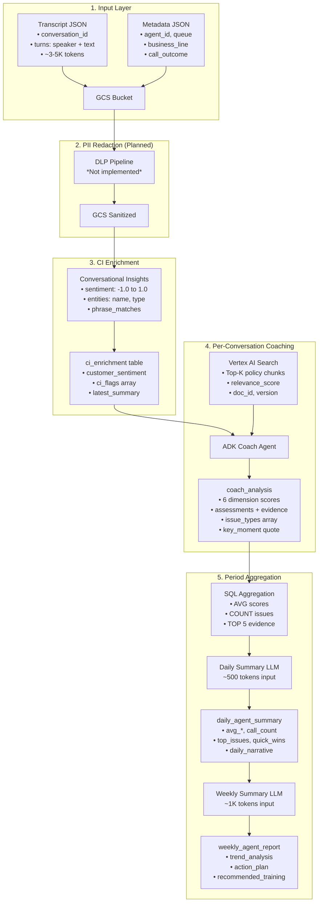

# AI Conversation Coach for Contact Centres

An **offline (post-call) AI coaching system** for contact centre agents, built on Google Cloud Platform with Vertex AI.

> **Problem**: Contact centres generate thousands of calls daily, but QA teams can only review ~2% manually. Compliance issues, poor customer handling, and coaching opportunities go undetected.

> **Solution**: Automated AI coaching that analyzes every conversation, provides evidence-based feedback, and generates actionable daily/weekly summaries for supervisors.

---

## Key Features

- **Per-Conversation Coaching** — Detailed scores (1-10) across 6 dimensions with evidence citations
- **Multi-Level Summaries** — Daily digests, weekly reports, and trend analysis with compression
- **RAG-Powered** — Retrieves relevant compliance policies (ASIC RG 96, internal) and coaching playbooks
- **Evidence-Based** — Every score backed by specific turn quotes and issue taxonomy
- **Compliance-Aware** — Detects hardship violations, prohibited language, and regulatory issues
- **Production-Grade** — 4-layer metrics, structured logging, distributed tracing, cost tracking

---

## Architecture Overview

### System Pipeline

```
┌───────────────────────────────────────────────────────────────────────────────────────┐
│                         CONVERSATION COACH PIPELINE (Detailed)                         │
├───────────────────────────────────────────────────────────────────────────────────────┤
│                                                                                        │
│   ┌──────────────┐     ┌──────────────┐     ┌──────────────┐                          │
│   │  GCS RAW     │────▶│ PII Redact   │────▶│ GCS SANITIZED│                          │
│   │  (Transcripts)     │ (DLP Pipeline)│     │ (Analytics-  │                          │
│   │  + Metadata  │     │ *Not MVP*    │     │  Ready)      │                          │
│   └──────────────┘     └──────────────┘     └───────┬──────┘                          │
│                                                      │                                 │
│                                                      ▼                                 │
│                                              ┌──────────────┐     ┌────────────────┐  │
│                                              │ Conversation │────▶│ BigQuery       │  │
│                                              │ Insights (CI)│     │ • conv_registry│  │
│                                              │ • Sentiment  │     │ • ci_enrichment│  │
│                                              │ • Entities   │     └───────┬────────┘  │
│                                              │ • Phrases    │             │            │
│                                              └──────────────┘             │            │
│                                                                           ▼            │
│   ┌──────────────────────────────────────────────────────────────────────────────┐   │
│   │                          ADK COACH AGENT (Gemini 2.5 Flash)                   │   │
│   │  ┌─────────────────────────────────────────────────────────────────────────┐  │   │
│   │  │  1. Fetch CI Data + Registry ──▶ 2. Build Prompt ──▶ 3. RAG Retrieval   │  │   │
│   │  │                                                           │              │  │   │
│   │  │                                                           ▼              │  │   │
│   │  │  4. Generate Coaching ◀───────────────────── Vertex AI Search ◀──┐      │  │   │
│   │  │          │                                    (Managed RAG)       │      │  │   │
│   │  │          ▼                                                        │      │  │   │
│   │  │  5. Store coach_analysis ──▶ 6. SQL Aggregation ──▶ 7. Period LLM │      │  │   │
│   │  └─────────────────────────────────────────────────────────────────────────┘  │   │
│   └──────────────────────────────────────────────────────────────────────────────┘   │
│                                                                                        │
│   ┌──────────────────────────────────────┐     ┌──────────────────────────────────┐  │
│   │  Knowledge Base Management           │     │  BigQuery Output Tables          │  │
│   │  ─────────────────────────           │     │  ─────────────────────           │  │
│   │  GCS: gs://cc-coach-kb/              │     │  • coach_analysis (per-conv)     │  │
│   │  ├── policy/POL-*.md                 │     │  • daily_agent_summary           │  │
│   │  ├── coaching/COACH-*.md             │     │  • weekly_agent_report           │  │
│   │  └── examples/EX-*.md                │────▶│                                  │  │
│   │                                      │     │  KB Metadata:                    │  │
│   │  Sources:                            │     │  • kb_documents (UUID + content) │  │
│   │  • Internal compliance policy        │     │  • kb_chunks (embeddings ref)    │  │
│   │  • ASIC RG 96 (external ref)         │     │  • kb_retrieval_log (audit)      │  │
│   │  • Coaching playbooks                │     └──────────────────────────────────┘  │
│   └──────────────────────────────────────┘                                            │
│                                                                                        │
└───────────────────────────────────────────────────────────────────────────────────────┘
```

### Key Design Decisions

| Decision | Choice | Rationale |
|----------|--------|-----------|
| **PII Handling** | Two-bucket model (RAW → SANITIZED) | RAW has restricted IAM; SANITIZED is analytics-safe |
| **Idempotency** | Registry state table | Prevents double processing, handles retries |
| **RAG Strategy** | Always-latest policy | Coaching reflects current best practices |
| **Aggregation** | SQL pre-compute → LLM summarize | Manages context window (80K tokens → 500 tokens) |

---

## Data Flow (Detailed)



### Aggregation Compression Strategy

| Level | Raw Data | LLM Input | Compression | Key Insight |
|-------|----------|-----------|-------------|-------------|
| Per-Conv | ~4K tokens (transcript) | ~4K tokens | None | Full context |
| Daily | 20 calls × 4K = 80K | ~500 tokens | **160x** | Metrics + 3 worst samples |
| Weekly | 7 days × 80K = 560K | ~1K tokens | **560x** | Daily summaries only |
| Monthly | 4 weeks | ~2K tokens | ~1000x | Weekly summaries only |

**Key design**: Higher levels never receive raw transcripts—only pre-computed scores and summaries from the level below.

---

## Key Data Tables

### Conversation Pipeline Tables

| Table | Purpose | Key Fields |
|-------|---------|------------|
| `conversation_registry` | State tracking, idempotency | `conversation_id`, `status` (NEW→COACHED), `agent_id`, `has_transcript`, `has_metadata` |
| `ci_enrichment` | CI analysis output | `customer_sentiment` (-1.0 to 1.0), `entities[]`, `phrase_matches{}`, `ci_flags[]` |
| `coach_analysis` | Per-conversation coaching | `overall_score`, `6 dimension scores`, `assessments[]` with evidence, `issue_types[]`, `key_moment{}` |
| `daily_agent_summary` | Daily aggregation | `avg_*` scores, `call_count`, `top_issues[]`, `quick_wins[]`, `daily_narrative`, `focus_area` |
| `weekly_agent_report` | Weekly aggregation | `*_score`, `trend_analysis`, `action_plan`, `recommended_training[]`, `week_start` |

### Knowledge Base Tables

| Table | Purpose | Key Fields |
|-------|---------|------------|
| `kb_documents` | Document registry + raw content | `doc_id` (UUID like POL-002), `version`, `status` (active/superseded), `business_lines[]`, `raw_content`, `checksum` |
| `kb_chunks` | Chunk content + embeddings ref | `chunk_id` (POL-002-v1.2.0-section-3), `section_path`, `content`, `embedding_id`, `is_active` |
| `kb_retrieval_log` | Audit trail | `retrieval_id`, `conversation_id`, `retrieved_chunks[]` with scores, `coach_model_version` |

**UUID Generation**: Documents are assigned semantic IDs (e.g., `POL-002`, `COACH-001`) in YAML frontmatter during ingestion. The `chunk_id` combines `doc_id-version-section`.

---

## Sample Coaching Outputs (Real Data)

### Exemplary Agent (Score: 9.9/10)

**Agent A2044** | Hardship Call | Resolution: Yes

```json
{
  "conversation_id": "3f2d9e4b-1a74-4f35-8bb2-9d8f8df0b6a7",
  "agent_id": "A2044",
  "overall_score": 9.9,
  "empathy_score": 10,
  "compliance_score": 10,
  "resolution_score": 10,
  "professionalism_score": 10,
  "de_escalation_score": 10,
  "efficiency_score": 9,

  "coaching_summary": "The agent demonstrated exceptional empathy and compliance, effectively de-escalating a stressed customer and securing a sustainable payment arrangement.",

  "strengths": [
    "Exceptional empathy and active listening skills",
    "Proactive and compliant offer of hardship programs",
    "Highly effective de-escalation of a stressed customer",
    "Collaborative approach to finding a sustainable resolution"
  ],

  "key_moment": {
    "turn_index": 11,
    "quote": "I completely understand, and thanks for being open about that. It sounds like you're under some real pressure right now. Look, we do have hardship options and flexible payment plans available.",
    "why_notable": "This turn perfectly demonstrates empathy, active listening, and immediate compliance with hardship policy, effectively turning a stressful situation into a path towards resolution."
  },

  "issue_types": ["EXCELLENT_EMPATHY", "PERFECT_COMPLIANCE", "EFFECTIVE_RESOLUTION"],
  "critical_issues": [],
  "compliance_breach_count": 0,
  "example_type": "GOOD_EXAMPLE"
}
```

### Critically Deficient Agent (Score: 1.0/10)

**Agent M7741** | Hardship Call | Resolution: No

```json
{
  "conversation_id": "a1b2c3d4-toxic-agent-test-0001",
  "agent_id": "M7741",
  "overall_score": 1.0,
  "empathy_score": 1,
  "compliance_score": 1,
  "resolution_score": 1,
  "professionalism_score": 1,
  "de_escalation_score": 1,
  "efficiency_score": 1,

  "coaching_summary": "The agent demonstrated a complete lack of empathy, professionalism, and compliance throughout the call, actively escalating a distressed customer. Multiple critical compliance violations occurred, including illegal threats and failure to offer a hardship program.",

  "assessments": [
    {
      "dimension": "empathy",
      "score": 1,
      "issue_types": ["DISMISSIVE_LANGUAGE", "NO_ACKNOWLEDGMENT", "BLAME_SHIFTING"],
      "evidence": [
        {
          "turn_index": 5,
          "quote": "Mr Chen, I've heard every excuse in the book. Medical bills, job loss, car problems. Everyone has a story. What I need from you right now is a commitment to pay.",
          "severity": "CRITICAL",
          "issue_type": "DISMISSIVE_LANGUAGE"
        },
        {
          "turn_index": 27,
          "quote": "Everyone's got an excuse. Dialysis, chemo, dying grandmother. I've heard it all. The fact remains you owe money and you need to pay it. Period.",
          "severity": "CRITICAL",
          "issue_type": "DISMISSIVE_LANGUAGE"
        }
      ]
    },
    {
      "dimension": "compliance",
      "score": 1,
      "issue_types": ["THREAT_LEGAL_ACTION", "THREAT_GARNISHMENT", "MISSING_HARDSHIP_OFFER"],
      "evidence": [
        {
          "turn_index": 9,
          "quote": "We're talking about legal action here. We can garnish your wages, put a lien on your property.",
          "severity": "CRITICAL",
          "issue_type": "THREAT_GARNISHMENT"
        },
        {
          "turn_index": 21,
          "quote": "If this goes to our legal team, they'll add another $2,500 in fees and you'll have a court judgment on your record.",
          "severity": "CRITICAL",
          "issue_type": "THREAT_LEGAL_ACTION"
        }
      ]
    }
  ],

  "critical_issues": [
    "DISMISSIVE_LANGUAGE", "NO_ACKNOWLEDGMENT", "BLAME_SHIFTING",
    "THREAT_LEGAL_ACTION", "THREAT_GARNISHMENT", "HARASSMENT", "MISSING_HARDSHIP_OFFER"
  ],
  "compliance_breach_count": 4,
  "issue_count": 16,
  "example_type": "NEEDS_WORK"
}
```

### Daily Summary (Real Output)

```json
{
  "agent_id": "M7741",
  "date": "2026-01-04",
  "call_count": 6,
  "resolution_rate": 0.0,

  "avg_empathy": 1.0,
  "avg_compliance": 1.0,
  "avg_resolution": 1.0,
  "avg_professionalism": 1.0,
  "avg_efficiency": 1.8,
  "avg_de_escalation": 1.0,

  "focus_area": "professionalism",

  "top_issues": [
    "THREAT_LEGAL_ACTION",
    "MISSING_HARDSHIP_OFFER",
    "NO_ACKNOWLEDGMENT",
    "BLAME_SHIFTING",
    "DISMISSIVE_LANGUAGE"
  ],

  "quick_wins": [
    "Review the company's Code of Conduct and policies regarding customer interaction and hardship handling before your next shift.",
    "Practice active listening and acknowledge the customer's statements, even if you cannot immediately offer a solution.",
    "Strictly follow the approved collections script, particularly when discussing payment options."
  ],

  "daily_narrative": "M7741, your performance today was critically low with an overall score of 1.1/10 and a 0% resolution rate across 6 calls. The language used, such as 'Everyone's got an excuse' and 'Compassion doesn't pay bills,' demonstrates a severe lack of professionalism and empathy."
}
```

### Weekly Summary (Real Output)

```json
{
  "agent_id": "M7741",
  "week_start": "2025-12-29",
  "total_calls": 7,
  "resolution_rate": 0.0,

  "empathy_score": 1.0,
  "compliance_score": 1.0,
  "resolution_score": 1.0,
  "professionalism_score": 1.0,
  "efficiency_score": 1.7,
  "de_escalation_score": 1.0,

  "trend_analysis": "Performance remained consistently low across the two days with calls, showing no improvement in any dimension. The 0% resolution rate and uniform 1.0 scores highlight a pervasive and unaddressed performance gap.",

  "action_plan": "1. Immediately review and adhere to all compliance guidelines, specifically regarding legal action threats and mandatory hardship offer procedures. 2. Focus on active listening and empathetic communication. 3. Review the Hardship Program Guide.",

  "recommended_training": [
    "Compliance Basics",
    "Empathy Building",
    "Hardship Program Guide"
  ],

  "weekly_summary": "Agent M7741's performance this week was critically deficient, with an overall average score of 1.1 out of 10 across 7 calls. All core metrics consistently scored 1.0, indicating a complete failure to meet basic expectations."
}
```

---

## Monitoring System

### 4-Layer Metrics Framework

The monitoring system follows industry-standard methodologies:

| Layer | Methodology | What It Measures |
|-------|-------------|------------------|
| **Layer 1: Infrastructure** | USE (Utilization, Saturation, Errors) | GCP auto-collected: CPU, memory, API quotas |
| **Layer 2: Data Pipeline** | USE | Input validation rate, CI enrichment health |
| **Layer 3: Component Health** | RED (Rate, Errors, Duration) | Per-component: data_fetch, rag_retrieval, model_call, storage |
| **Layer 4: Application (E2E)** | RED | Overall success rate, total latency, error rate |

```
┌─────────────────────────────────────────────────────────────────────────────┐
│                    4-LAYER METRICS ARCHITECTURE                              │
├─────────────────────────────────────────────────────────────────────────────┤
│                                                                             │
│   Layer 4: APPLICATION (RED)                               ✅ MVP           │
│   ─────────────────────────                                                 │
│   • e2e_success_rate (>95% target)                                         │
│   • e2e_error_rate (<5% target)                                            │
│   • e2e_latency_p95 (<30s target)                                          │
│                                                                             │
│   Layer 3: COMPONENT HEALTH (RED)                          ✅ MVP           │
│   ────────────────────────────                                             │
│   │ data_fetch ──▶ rag_retrieval ──▶ model_call ──▶ storage │              │
│   │ success: 98%    success: 92%      latency: 22s   success: 100%│        │
│   │ latency: 3.4s   docs_found: 3     tokens: 4K     stored: true │        │
│                                                                             │
│   Layer 2: DATA PIPELINE (USE)                             ⚠️ Basic        │
│   ──────────────────────────                                               │
│   • Input validation rate                                                  │
│   • CI enrichment health                                                   │
│                                                                             │
│   Layer 1: INFRASTRUCTURE (USE)                            ✅ Auto         │
│   ───────────────────────────                                              │
│   • GCP auto-collects: CPU, memory, API quotas                             │
│                                                                             │
└─────────────────────────────────────────────────────────────────────────────┘
```

### Structured Logging

JSON-structured logs optimized for GCP Cloud Logging parsing:

```python
{
  "severity": "INFO",
  "message": "Component: model_call",
  "timestamp": "2026-01-07T03:21:00Z",
  "labels": {"service": "conversation-coach", "component": "model_call"},
  "logging.googleapis.com/trace": "projects/xxx/traces/abc123",
  "jsonPayload": {
    "component": "model_call",
    "success": true,
    "duration_ms": 22400,
    "model": "gemini-2.5-flash",
    "input_tokens": 3274,
    "output_tokens": 1914,
    "cost_usd": 0.0008
  }
}
```

### Distributed Tracing (OpenTelemetry + ADK)

```
┌─────────────────────────────────────────────────────────────────────────────┐
│              TRACE STRUCTURE: ACTUAL IMPLEMENTATION                          │
├─────────────────────────────────────────────────────────────────────────────┤
│                                                                             │
│   e2e_coaching       │████████████████████████████████████████│  35,711ms  │
│   ├─data_fetch       │███·····································│   3,546ms  │
│   ├─input_processing │···█····································│      92ms  │
│   ├─rag_retrieval    │····█···································│      88ms  │
│   ├─model_call       │····███████████████████████████████·····│  28,438ms  │ ← 80%
│   ├─output_processing│····································█···│     101ms  │
│   └─storage          │····································███·│   3,374ms  │
│                                                                             │
│   Direct export to Cloud Trace (no collector needed)                        │
│   ADK auto-instruments: invoke_agent, call_llm, execute_tool                │
│                                                                             │
└─────────────────────────────────────────────────────────────────────────────┘
```

### Cost Tracking

Per-request cost calculated from token usage:

```python
{
  "component": "model_call",
  "input_tokens": 3274,
  "output_tokens": 1914,
  "cost_usd": 0.0008,  # Gemini 2.5 Flash pricing
  "daily_total": 3.35   # Aggregated daily cost
}
```

### Alert Design (70% Value, 10-20% Work)

| Priority | Alert | Condition | Action |
|----------|-------|-----------|--------|
| **P1** | System Down | E2E error rate >50% for 5 min | PagerDuty |
| **P2** | Degraded | E2E error rate >10% for 10 min | Slack |
| **P2** | High Latency | P95 latency >30s for 10 min | Slack |
| **P4** | Cost Spike | Daily cost >$50 | Email |

```yaml
# Example Alert Policy
- displayName: "Coach - P1 - System Down"
  conditions:
    - conditionThreshold:
        filter: 'metric.type="custom.googleapis.com/coach/e2e_success"'
        comparison: COMPARISON_LT
        thresholdValue: 0.5
        duration: 300s
```

**CLI Dashboard:**
```bash
cc-coach monitor summary

╭─────────────────────────────────╮
│ CONVERSATION COACH - MONITORING │
│ 2026-01-07 (Today)              │
╰─────────────────────────────────╯
  E2E Success Rate    ████████████░░░░░ 66.7% (8/12)
  Total Requests      12
  Latency (p50)       30.4s

  Component Health:
  data_fetch        ████████████░░░ 92%   3.4s
  model_call        ██████████░░░░░ 73%  22.4s
  storage           ███████████████ 100%  3.1s

  Cost Today:  $0.0063
```

See [monitoring_system_design.md](design/monitoring_system_design.md) for full implementation details.

---

## Component Deep Dives

### 1. Ingestion & State Management

**Purpose**: Ensure idempotent, reliable conversation ingestion with state tracking.

**Key Considerations**:
- Two-file pairing (transcript + metadata) with registry state table
- Status progression: `NEW → SANITIZED → INGESTED → ENRICHED → COACHED`
- Handles out-of-order arrivals and retries
- CI (Conversational Insights) exports directly to BigQuery

**Design Doc**: [HLD.md](design/HLD.md) — Sections 3-4

---

### 2. PII Redaction Pipeline

**Purpose**: Protect customer PII before analytics processing.

**Key Considerations**:
- Two-bucket model: RAW (restricted IAM) → SANITIZED (analytics-safe)
- DLP API for redaction/tokenization (not implemented for MVP)
- Audit trail: `redaction_version`, `pii_types_found[]` in registry
- Compliance with Australian Privacy Act

**Status**: Designed, not implemented for MVP.

**Design Doc**: [pii_redaction_design.md](design/pii_redaction_design.md)

---

### 3. Conversational Insights (CI) Integration

**Purpose**: Pre-processing layer for sentiment, entities, and phrase detection.

**Key Considerations**:
- CI handles: customer sentiment, keyword detection, call summary, topic modeling
- ADK Coach handles: agent behavior assessment, contextual compliance, coaching recommendations
- Phrase matchers for compliance violations, required disclosures, empathy indicators
- Future: QA Scorecard (needs 2,000+ labeled examples), Topic Model (needs 1,000+ conversations)

**Design Doc**: [phrase_matcher_design.md](design/phrase_matcher_design.md)

---

### 4. ADK Coach Agent

**Purpose**: Per-conversation coaching with structured output and RAG retrieval.

**Key Considerations**:
- Google ADK framework with Pydantic output schemas
- 6-dimension scoring: empathy, compliance, resolution, professionalism, efficiency, de-escalation
- Evidence-based: every score backed by turn quotes and issue taxonomy
- Issue taxonomy: EMPATHY_ISSUES (dismissive, no_acknowledgment), COMPLIANCE_ISSUES (threat_legal_action, missing_hardship_offer), etc.

```python
Agent(
    name="conversation_coach",
    model="gemini-2.5-flash",
    instruction=SYSTEM_PROMPT,
    output_schema=CoachingOutput,  # Pydantic model
)
```

**Design Docs**:
- [phase1_adk_conversation_coach.md](design/phase1_adk_conversation_coach.md) — ADK implementation
- [adk_framework_guide.md](design/adk_framework_guide.md) — ADK patterns and best practices

---

### 5. RAG Knowledge Base

**Purpose**: Retrieve relevant compliance policies and coaching playbooks for context.

**Key Considerations**:
- **Always-latest retrieval**: Vector store only contains ACTIVE chunks (no time-travel)
- **Unified ingestion**: GCS → Vector Store (Vertex AI Search) + BQ (metadata)
- **Document types**: policy (POL-*), coaching (COACH-*), examples (EX-*)
- **Sources**: Internal compliance, ASIC RG 96 (external ref), coaching playbooks
- **Chunking**: Split by section headings, 200-500 tokens per chunk
- **Metadata filtering**: business_line, queue, effective_date

**UUID Management**: Documents assigned semantic IDs (`POL-002`) in YAML frontmatter. Chunks get compound IDs (`POL-002-v1.2.0-section-3`).

**Design Docs**:
- [rag_knowledge_base_design.md](design/rag_knowledge_base_design.md) — KB structure and lifecycle
- [rag_pipeline_design.md](design/rag_pipeline_design.md) — Retrieval pipeline
- [metadata_management_design.md](design/metadata_management_design.md) — Document versioning
- [rag_coach_integration_design.md](design/rag_coach_integration_design.md) — RAG + Coach integration

---

### 6. Period Summary Generation

**Purpose**: Aggregate per-conversation coaching into daily/weekly reports.

**Key Considerations**:
- **Evidence over metrics**: Show WHY scores, not just numbers
- **Compression strategy**: SQL aggregation → LLM summarization
- **Daily**: ~500 tokens input (metrics + top 3 worst samples)
- **Weekly**: ~1K tokens input (daily summaries + week metrics)
- **Components**: overview, key moments, issues with evidence, strengths, focus for tomorrow

```
Per-Conv Scores → BQ Aggregation (SQL) → Period Coach (LLM) → Report
```

**Design Doc**: [period_summary_design.md](design/period_summary_design.md)

---

### 7. Evaluation Framework

**Purpose**: Measure coaching quality and detect regressions.

**Key Considerations**:
- Hard gates: JSON schema validity (>99.5%), no hallucinated citations
- Soft gates: Risk flag recall (>85%), citation coverage (>90%)
- Regression dataset: 100-500 curated conversations with labeled expectations
- LLM-judge for quality scoring (separate from compliance gates)

**Status**: Designed, not implemented for MVP.

**Design Doc**: [evaluation_framework.md](design/evaluation_framework.md)

---

## Implementation

### Technology Stack

| Component | Technology |
|-----------|------------|
| **LLM Framework** | Google ADK (Agent Development Kit) |
| **Model** | Gemini 2.5 Flash |
| **RAG** | Vertex AI Search (managed) |
| **Storage** | BigQuery |
| **Schemas** | Pydantic |
| **CLI** | Typer + Rich |
| **Logging** | Structured JSON + contextvars |
| **Tracing** | OpenTelemetry + Cloud Trace |

### Key Files

```
cc_coach/
├── agents/
│   ├── conversation_coach.py   # Per-conversation coaching agent
│   └── summary_coach.py        # Daily/weekly summary agents
├── services/
│   ├── coaching.py             # Orchestration service
│   ├── aggregation.py          # SQL aggregation queries
│   └── summary.py              # Period summary generation
├── schemas/
│   ├── coaching.py             # Pydantic models for coaching output
│   └── summary.py              # Pydantic models for summaries
└── monitoring/
    ├── logging.py              # Structured logging with contextvars
    └── tracing.py              # OpenTelemetry setup
```

### CLI Commands

```bash
# Per-conversation coaching
cc-coach coach generate <conversation_id>
cc-coach coach batch --date 2026-01-04

# Summaries
cc-coach summary daily --agent A1029 --date 2026-01-04
cc-coach summary weekly --agent A1029 --week 2025-12-29

# Monitoring
cc-coach monitor summary
cc-coach monitor logs --tail 20
```

---

## Design Documents

| Document | Description |
|----------|-------------|
| [HLD.md](design/HLD.md) | High-level architecture, data flow, key design decisions |
| [phase1_adk_conversation_coach.md](design/phase1_adk_conversation_coach.md) | ADK implementation, prompts, output schemas |
| [solution_roadmap.md](design/solution_roadmap.md) | Multi-level coaching approach, phasing |
| [rag_knowledge_base_design.md](design/rag_knowledge_base_design.md) | KB structure, document lifecycle, BQ tables |
| [rag_pipeline_design.md](design/rag_pipeline_design.md) | RAG retrieval pipeline, chunking strategy |
| [rag_coach_integration_design.md](design/rag_coach_integration_design.md) | How RAG integrates with coach agent |
| [metadata_management_design.md](design/metadata_management_design.md) | Document versioning, effective dates |
| [monitoring_system_design.md](design/monitoring_system_design.md) | 4-layer metrics, USE/RED methodology, alerts |
| [period_summary_design.md](design/period_summary_design.md) | Daily/weekly aggregation, compression strategy |
| [phrase_matcher_design.md](design/phrase_matcher_design.md) | CI phrase matchers for compliance detection |
| [pii_redaction_design.md](design/pii_redaction_design.md) | PII handling, two-bucket model |
| [evaluation_framework.md](design/evaluation_framework.md) | Regression testing, quality metrics |
| [implementation_note.md](design/implementation_note.md) | Implementation notes and decisions |

---

## Requirements & Scope

### In Scope (MVP)

- Per-conversation coaching with 6-dimension scoring
- Evidence-based assessments with turn citations
- RAG retrieval from compliance policies and playbooks
- Daily and weekly summary generation
- Structured logging and 4-layer metrics
- Distributed tracing (OpenTelemetry + Cloud Trace)
- CLI for all operations

### Out of Scope (MVP)

- Real-time in-call Agent Assist
- PII redaction pipeline (designed, not implemented)
- CI QA Scorecard (requires 2,000+ labeled conversations)
- CI Topic Model (requires 1,000+ conversations)
- Evaluation framework (designed, not implemented)

### Next Steps

1. PII redaction pipeline implementation
2. Evaluation framework for coaching quality
3. Dashboard UI (Looker Studio integration)
4. Production deployment automation (Cloud Run + Scheduler)

---

## Deferred Production Features

Features designed but not implemented for MVP. See [good_for_prod_wont_implement_for_now.md](design/good_for_prod_wont_implement_for_now.md) for details.

| Feature | Trigger to Implement |
|---------|---------------------|
| **CI QA Scorecard** | 2,000+ labeled conversations for training |
| **CI Topic Model** | 1,000+ conversations for topic clustering |
| **Analysis Versioning** | Pre-production audit requirements |
| **RAG Document Tracking** | KB versioning needed for compliance |
| **Re-analysis Workflow** | When prompt/model/KB updates are frequent |
| **coach_analysis_latest View** | When implementing analysis versioning |
| **Drift Detection** | Volume > 100/day, need statistical significance |
| **LLM Observability Tools** | Complex multi-agent flows, frequent prompt iteration |
| **Golden Dataset Testing** | After prompt/model changes cause issues |

---

## Dev Data

Test data generated using ADK multi-agent conversation simulator:

| Characteristic | Distribution |
|----------------|--------------|
| **Agents** | 8 unique agents (A1029, A1045, A2033, A2044, A3099, A4021, A5012, M7741) |
| **Call Types** | hardship, collections, payment, complaint |
| **Score Range** | 1.0 (toxic) to 9.9 (exemplary) |
| **Date Range** | 2026-01-01 to 2026-01-07 |
| **Total Conversations** | ~50 |

**Agent Personas:**
- **Good agents**: A1029, A1045, A2044, A4021 (scores 7-10) — empathetic, compliant
- **Average agents**: A2033, A3099, A5012 (scores 5-8) — generally good with occasional issues
- **Poor agent**: M7741 (scores 1-2) — deliberately toxic for testing compliance detection

---

## Quick Start

```bash
# Navigate to CLI
cd usecases/conversation-coach/artifacts/cli

# Activate environment
source .venv/bin/activate

# Set credentials
export GOOGLE_APPLICATION_CREDENTIALS=~/.config/gcloud/vertex-ai-demo-key.json
export GOOGLE_GENAI_USE_VERTEXAI=true
export GOOGLE_CLOUD_PROJECT=vertexdemo-481519
export GOOGLE_CLOUD_LOCATION=us-central1

# Run coaching
cc-coach coach generate <conversation_id>

# Generate daily summary
cc-coach summary daily --agent M7741 --date 2026-01-04

# Check monitoring
cc-coach monitor summary
```

---

## License

Internal use only. Not for external distribution.
