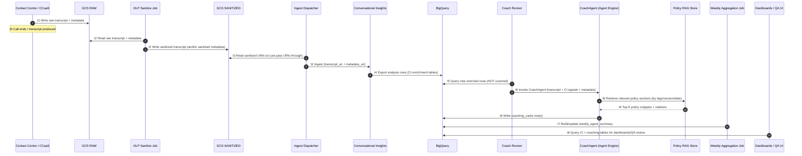

# High Level Design (HLD): Contact Centre Conversational Insights + AI Coach (GCP / Vertex) — with RAG

## 0) Executive summary
We build an **offline (post-call) analytics + coaching pipeline** for a contact centre handling:
- **Debt collection** (owned + purchased portfolios)
- **Small personal loans**
- **Inbound + outbound** calls (voice and/or chat)

Core idea:
1) Store conversation artifacts (transcripts/audio) + business metadata
2) Run **Conversational Insights (CI)** to produce structured signals (topics/drivers, sentiment, entities, etc.)
3) Store everything in **BigQuery** as the analytics "spine"
4) Run a **CoachAgent** (Vertex AI Agent Engine) to produce:
   - per-call coaching cards (compliance checks + evidence + actions)
   - aggregated weekly summaries per agent/team
5) Use **RAG** to retrieve the correct **versioned policy manual** sections and "coaching playbook" snippets, and cite them.

### Implementation Status

| Phase | Component | Status | Design Doc |
|-------|-----------|--------|------------|
| 0 | CI Pipeline + Phrase Matchers | ✅ DONE | - |
| 1 | Per-Conversation ADK Coach + RAG | 🔄 CURRENT | `phase1_adk_conversation_coach.md` |
| 2 | Daily Summary Aggregation | Next | - |
| 3 | Weekly Report + Dashboard | MVP | - |
| 4 | Evaluation Framework | Post-MVP | `evaluation_framework.md` |
| 5 | Monitoring & Alerting | Post-MVP | - |
| 6 | FinOps & Cost Management | Post-MVP | - |

**MVP Definition**: Bot can do per-conversation coaching, daily summary, and weekly summary with RAG.

---

## 1) Goals and non-goals

### Goals
- Automated post-call enrichment + coaching for QA/supervisors
- Compliance-aware outputs (privacy / wrong-party, contact preferences, hardship, non-harassment)
- Auditable: evidence snippets + policy citations + versioning
- Production-grade: idempotency, monitoring, cost controls, regression testing

### Non-goals (v1)
- Real-time in-call “Agent Assist”
- Automated account changes without human approval
- Full telephony provisioning design (assume CCaaS/telephony already exists)

---

## 2) System context (what integrates with what)

### Upstream systems (sources of truth)
- **Contact centre / CCaaS**: call sessions, agent assignment, queue, call direction, timestamps, recordings, transcript generation (if available)
- **CRM / collections / loan system**: portfolio_id, campaign_id, account/product flags, outcome codes

### Core platform components
- **GCS**: raw artifacts + sanitized artifacts
- **DLP pipeline**: redact/tokenize PII before analytics ingestion
- **CI**: analysis/enrichment
- **BigQuery**: storage/analytics spine
- **Agent Engine**: host CoachAgent
- **RAG store**: policy + playbook retrieval (versioned)
- **Looker / Looker Studio**: dashboards for trends/drilldown

---

## 3) Architecture overview

### 3.1 Data flow diagram (text)

```
          ┌─────────────────────────────────────┐
          │  Contact Centre / CCaaS + CRM        │
          │  - inbound/outbound calls            │
          │  - agent_id, queue, campaign         │
          │  - recordings/transcripts            │
          └───────────────────┬─────────────────┘
                              │
                              ▼
            ┌────────────────────────────────┐
            │ GCS RAW (restricted access)     │
            │ - raw transcript/audio          │
            │ - raw metadata JSON             │
            └───────────────┬────────────────┘
                            │
                            │ (trigger)
                            ▼
            ┌────────────────────────────────┐
            │ DLP Sanitize (Cloud Run job)    │
            │ - redact/tokenize PII           │
            │ - write sanitized copies        │
            └───────────────┬────────────────┘
                            │
                            ▼
            ┌────────────────────────────────┐
            │ GCS SANITIZED (analytics-ready) │
            │ - sanitized transcript/audio    │
            │ - metadata JSON                 │
            └───────────────┬────────────────┘
                            │
                            │ CI ingest via GCS URIs
                            ▼
            ┌────────────────────────────────┐
            │ Conversational Insights (CI)    │
            │ - topics/drivers                │
            │ - sentiment, entities           │
            │ - (if audio) talk/silence etc.  │
            └───────────────┬────────────────┘
                            │
                            │ CI export (configured)
                            ▼
            ┌────────────────────────────────┐
            │ BigQuery (analytics spine)      │
            │ - registry/state table          │
            │ - CI enrichment tables          │
            │ - coaching_cards                │
            │ - weekly_agent_summary          │
            └───────────────┬────────────────┘
                            │
                            │ scheduled coach runner
                            ▼
 ┌────────────────────────────────────────────────────┐
 │ Vertex AI Agent Engine: CoachAgent (ADK)            │
 │ - consumes transcript + CI signals + metadata       │
 │ - RAG retrieves policy/playbook snippets            │
 │ - outputs structured coaching card + citations      │
 └────────────────────────────────────────────────────┘
                            │
                            ▼
                 ┌─────────────────────┐
                 │ Looker dashboards   │
                 │ + QA workflows      │
                 └─────────────────────┘

```

### 3.2 Time sequence (single conversation)





---

## 4) Key design decisions

### 4.1 Two-bucket model for PII safety
- **RAW** bucket: restricted IAM; contains PII
- **SANITIZED** bucket: only redacted/tokenized; safe for CI/analytics
- Keep an audit trail of redaction version per conversation.

### 4.2 Idempotency + pairing (transcript + metadata)
GCS events fire per object. We avoid double processing by maintaining a **registry state table**:
- record whether transcript + metadata exist
- only ingest when both exist and status is not yet processed
- safe on retries and out-of-order arrivals

### 4.3 BigQuery is the “spine”
- CI exports directly into BigQuery (no custom ETL required for CI output)
- Our code primarily:
  - creates datasets/tables
  - queries “work to do”
  - writes coaching outputs + aggregates

### 4.4 Coaching is per-conversation first, then aggregated
- **Per conversation** coaching is the primary product (actionable)
- Aggregation is derived from coaching outputs + CI signals (weekly summaries)

### 4.5 RAG is for policy/playbook retrieval with version control
- Compliance is auditable only if the coach:
  - retrieves correct policy version
  - cites exact sections/snippets
  - can be reproduced later

---

## 5) Components (HLD)

### 5.1 Storage
**GCS RAW**
- `/transcripts/{conversation_id}.json`
- `/metadata/{conversation_id}.json`
- optional: `/audio/{conversation_id}.wav`

**GCS SANITIZED**
- same structure, sanitized transcript + (optionally) sanitized audio

### 5.2 Processing services
**A) ingest_dispatcher (Cloud Run or Cloud Functions)**
- Trigger: object finalize events on SANITIZED transcript/metadata
- Behavior:
  - parse conversation_id
  - upsert registry record
  - if both transcript & metadata exist and status != INGESTED -> call CI ingest

**B) dlp_sanitizer (Cloud Run job)**
- Trigger: object finalize events on RAW bucket (or scheduled batch)
- Behavior:
  - read raw transcript/audio
  - apply de-identification rules (mask, tokenize, redact)
  - write sanitized output to SANITIZED bucket
  - write `redaction_version` and `pii_types_found` fields in registry

**C) coach_runner (Cloud Run job + Cloud Scheduler)**
- Trigger: scheduled (e.g., every 5 minutes)
- Behavior:
  - query BigQuery for conversations where:
    - CI enrichment exists AND
    - no coaching_card exists
  - call CoachAgent per conversation (parallelizable)
  - write coaching_cards rows (structured)
  - update registry state

**D) weekly_aggregator (Cloud Run job + Scheduler weekly)**
- Trigger: weekly schedule
- Behavior:
  - aggregate coaching_cards + CI signals by agent/week
  - write weekly_agent_summary

---

## 6) Data model (high level)

### 6.1 conversation_registry (control/state)
Purpose: idempotency, pairing, audit, retries.

Fields:
- conversation_id (PK)
- transcript_uri_raw, metadata_uri_raw, audio_uri_raw
- transcript_uri_sanitized, metadata_uri_sanitized, audio_uri_sanitized
- has_transcript, has_metadata, has_audio
- status: NEW | SANITIZED | INGESTED | ENRICHED | COACHED | FAILED
- redaction_version, pii_types_found[]
- ci_conversation_name (CI handle)
- last_error, retry_count
- timestamps: created_at, updated_at

### 6.2 ci_enrichment (CI export tables)
CI exports schema-versioned tables. We rely on key fields:
- transcript (STRING)
- sentiment fields (agent/client)
- entities[] (type, salience, speakerTag, text)
- labels (user metadata labels)
- (if audio) talk/silence % fields

### 6.3 coach_analysis (per-conversation coaching output)

Purpose: Store LLM-generated coaching scores and feedback for each conversation. This is the foundation for all aggregation.

**Core Design Principle**: Scores alone are meaningless. Every score needs:
- **Issue Type** (categorical, for pattern detection)
- **Evidence** (quotes from transcript, for proof and coaching)
- **Coaching Point** (actionable advice)

One row per conversation:

**Identity Fields:**
- conversation_id (PK)
- agent_id (REQUIRED) - For aggregation
- business_line (STRING) - "COLLECTIONS" | "LOANS"
- team (STRING)
- queue (STRING)
- analyzed_at (TIMESTAMP)

**Overall Scores (1-10 scale, for dashboards/AVG):**
- empathy_score - Did agent show understanding?
- professionalism_score - Appropriate tone/language?
- compliance_score - Followed required disclosures?
- resolution_score - Did agent solve the problem?
- de_escalation_score - If customer upset, did agent calm them?
- efficiency_score - Call handled efficiently?
- overall_score (FLOAT) - Weighted average

**Evidence-Based Assessments (key addition):**
```
assessments[] (REPEATED RECORD):
├── dimension (STRING)        # "empathy", "compliance", etc.
├── score (INTEGER)
├── issue_types[] (STRING)    # ["DISMISSIVE", "NO_ACK"]
├── evidence[] (RECORD):
│   ├── turn_index (INTEGER)
│   ├── speaker (STRING)      # "AGENT" or "CUSTOMER"
│   ├── quote (STRING)        # Actual text (~100 chars)
│   ├── issue_type (STRING)   # Specific issue
│   └── severity (STRING)     # CRITICAL, HIGH, MEDIUM, LOW
└── coaching_point (STRING)   # Specific actionable advice
```

**Issue Taxonomy (for pattern detection):**
```
EMPATHY_ISSUES:
├── DISMISSIVE_LANGUAGE        "heard every excuse"
├── NO_ACKNOWLEDGMENT          Didn't acknowledge hardship
├── RUSHING_CUSTOMER           Cut customer off, hurried
├── BLAME_SHIFTING             "that's your responsibility"
└── LACK_OF_PATIENCE           Short responses, sighing

COMPLIANCE_ISSUES:
├── THREAT_LEGAL_ACTION        Threatened court/lawyers
├── THREAT_GARNISHMENT         Threatened wage garnishment
├── HARASSMENT                 Excessive pressure
├── MISSING_DISCLOSURE         Didn't mention dispute rights
├── MISSING_HARDSHIP_OFFER     Didn't offer hardship options
└── PRIVACY_VIOLATION          Disclosed to third party

RESOLUTION_ISSUES:
├── NO_PAYMENT_OPTIONS         Didn't offer flexible payment
├── UNREALISTIC_DEMANDS        Demanded full payment immediately
├── FAILED_DE_ESCALATION       Customer more upset at end
└── UNRESOLVED_WITHOUT_ACTION  Call ended without next steps
```

**Quick-Access Issue Summary (for filtering/aggregation):**
- issue_types[] (STRING) - All issues in this call
- critical_issues[] (STRING) - Only CRITICAL severity
- issue_count (INTEGER)
- compliance_breach_count (INTEGER)

**Binary Flags (for COUNT/% aggregation):**
- resolution_achieved (BOOLEAN)
- escalation_required (BOOLEAN)
- customer_started_negative (BOOLEAN) - For de-escalation tracking

**Call Classification:**
- call_type (STRING) - hardship, complaint, payment, etc.
- call_outcome (STRING) - From metadata

**Coaching Output:**
- coaching_summary (STRING) - 2-3 sentence summary
- coaching_points[] (STRING)
- strengths[] (STRING)
- example_type (STRING) - "GOOD_EXAMPLE", "NEEDS_WORK", null

**Situation Context:**
- situation_summary (STRING) - What was the call about
- behavior_summary (STRING) - How agent handled it
- key_moment (RECORD):
  - turn_index (INTEGER)
  - quote (STRING)
  - why_notable (STRING) - Most notable moment for reference

**From CI (pre-computed):**
- customer_sentiment (FLOAT) - Overall from CI
- customer_sentiment_start (FLOAT) - First turn sentiment
- customer_sentiment_end (FLOAT) - Last turn sentiment
- ci_flags[] (STRING) - From phrase matcher

**Policy Citations (RAG):**
```
policy_citations[] (REPEATED RECORD):
├── policy_id (STRING)
├── section_id (STRING)
└── relevance (STRING)
```

**Metadata:**
- model_version (STRING)
- prompt_version (STRING)
- duration_sec (INTEGER)
- turn_count (INTEGER)

### 6.4 daily_agent_summary (daily aggregation)

Purpose: Pre-computed daily metrics for each agent. Enables daily coaching without exceeding context limits.

One row per agent per day:

**Identity Fields:**
- agent_id (REQUIRED)
- business_line (STRING)
- team (STRING)
- date (DATE, REQUIRED)
- generated_at (TIMESTAMP)

**Metrics (pre-aggregated from coach_analysis):**
- call_count (INTEGER)
- avg_empathy, avg_compliance, avg_resolution, avg_professionalism (FLOAT)
- avg_efficiency, avg_de_escalation (FLOAT)
- resolution_rate (FLOAT) - resolved_count / call_count
- compliance_breach_count (INTEGER)

**Issue Distribution (for pattern detection):**
```
issue_distribution[] (REPEATED RECORD):
├── issue_type (STRING)
├── count (INTEGER)
└── severity_breakdown (JSON)  # {"CRITICAL": 1, "HIGH": 3}
```

**Top Evidence (keep worst 5 for context):**
```
top_evidence[] (REPEATED RECORD):
├── conversation_id (STRING)
├── issue_type (STRING)
├── turn_index (INTEGER)
├── quote (STRING)
└── severity (STRING)
```

**Categorical Aggregates:**
- top_issues[] (STRING)
- top_strengths[] (STRING)

**LLM Generated:**
- daily_narrative (STRING) - 2-3 sentence summary
- focus_area (STRING) - Primary coaching focus for tomorrow
- quick_wins[] (STRING) - Easy improvements

**Rich Example References (not just IDs):**
```
example_conversations[] (REPEATED RECORD):
├── conversation_id (STRING)
├── example_type (STRING)       # "GOOD_EXAMPLE" or "NEEDS_WORK"
├── headline (STRING)           # "Hardship case - de-escalated angry to grateful"
├── key_moment (RECORD):
│   ├── turn_index (INTEGER)
│   ├── quote (STRING)
│   └── why_notable (STRING)
├── outcome (STRING)            # "90-day hold + fee waiver"
├── sentiment_journey (STRING)  # "-1.0 → +1.0"
├── scores (JSON)               # {"empathy": 9, "compliance": 10}
└── call_type (STRING)
```

**Trend vs Previous Day:**
- empathy_delta (FLOAT)
- compliance_delta (FLOAT)

### 6.5 weekly_agent_report (weekly aggregation)

Purpose: Weekly coaching report with radar chart data and trend analysis.

One row per agent per week:

**Keys:**
- agent_id, week_start (composite PK) - week_start is Monday
- generated_at

**Week scores (for radar/hexagon chart):**
- empathy_score, compliance_score, resolution_score
- professionalism_score, efficiency_score, de_escalation_score

**Trend vs previous week:**
- empathy_delta, compliance_delta, resolution_delta
- (This week score - last week score)

**Counts:**
- total_calls, resolution_rate, compliance_breach_count

**Top items:**
- top_issues[], top_strengths[]
- recommended_training[] - Suggested modules

**LLM narrative:**
- weekly_summary - 3-5 sentence summary
- trend_analysis - What's improving/declining
- action_plan - 2-3 specific actions

**Reference calls:**
- exemplary_call_ids[] - Best calls to review as examples
- needs_review_call_ids[] - Worst calls for coaching

---

## 7) CoachAgent (Vertex Agent Engine + ADK) design

### 7.1 What the CoachAgent receives
Input payload (single conversation):
- metadata (direction, business_line, queue, agent_id, campaign_id, portfolio_id, call_outcome)
- transcript turns (speaker-labeled)
- CI signals (sentiment, entities, driver/topic, optionally talk/silence)
- policy context selector (effective date, policy pack id/version constraints)

### 7.2 What the CoachAgent does (single-agent, 80% value)
1) Validate input and ensure output JSON schema
2) Run deterministic heuristics (optional but recommended):
   - detect wrong-party cues
   - detect contact preference changes
   - detect hardship/vulnerability indicators
3) RAG retrieval:
   - query policy library with filters:
     - business_line, direction, queue
     - effective_date
     - policy version constraints
   - retrieve top K snippets with metadata (doc_id/version/section)
4) Generate coaching card:
   - summary bullets
   - compliance checks with evidence + citations
   - risk flags
   - recommended next actions (structured)

### 7.3 Output contract
Always produce strict JSON that matches `coaching_cards` schema.
Failure mode: return an error object + reason (do not emit partial invalid JSON).

---

## 7.5) Multi-Level Coaching Architecture

The coaching system operates at multiple time granularities. Each level builds on the previous, with progressively compressed data to manage context window limits.

### 7.5.1 Coaching Levels

```
┌─────────────────────────────────────────────────────────────────────────┐
│                         MULTI-LEVEL COACHING                             │
├─────────────────────────────────────────────────────────────────────────┤
│                                                                          │
│   Level 1              Level 2              Level 3           Level 4   │
│   Per-Conversation     Daily               Weekly             Monthly    │
│                                                                          │
│   ┌──────────────┐    ┌──────────────┐    ┌──────────────┐  ┌────────┐  │
│   │ Full         │    │ Aggregated   │    │ Daily        │  │ Weekly │  │
│   │ transcript   │───▶│ metrics +    │───▶│ summaries +  │─▶│summaries│ │
│   │ ~3-5K tokens │    │ worst calls  │    │ week metrics │  │        │  │
│   │              │    │ ~500 tokens  │    │ ~1K tokens   │  │~2K tok │  │
│   └──────────────┘    └──────────────┘    └──────────────┘  └────────┘  │
│          │                   │                   │                │      │
│          ▼                   ▼                   ▼                ▼      │
│   ┌──────────────┐    ┌──────────────┐    ┌──────────────┐  ┌────────┐  │
│   │coach_analysis│    │daily_agent_  │    │weekly_agent_ │  │monthly │  │
│   │ (BQ table)   │    │summary (BQ)  │    │report (BQ)   │  │report  │  │
│   └──────────────┘    └──────────────┘    └──────────────┘  └────────┘  │
│                                                                          │
│   BUILD FIRST ◀─────────────────────────────────────────▶ BUILD LATER   │
└─────────────────────────────────────────────────────────────────────────┘
```

### 7.5.2 Context Window Strategy

| Level | Raw Data | LLM Input | Compression |
|-------|----------|-----------|-------------|
| Per-Conversation | ~4K tokens | ~4K tokens | None (full transcript) |
| Daily | 20 calls × 4K = 80K | ~500 tokens | 160x (metrics + 3 samples) |
| Weekly | 7 days × 80K = 560K | ~1K tokens | 560x (daily summaries) |
| Monthly | 4 weeks | ~2K tokens | ~1000x (weekly summaries) |

**Key design decision**: Higher levels never receive raw transcripts. They receive pre-computed scores and summaries from the level below.

### 7.5.3 Aggregation Pattern

```
Per-Conv Scores → BQ Aggregation (SQL) → Period Coach (LLM) → Report
```

Example daily aggregation (SQL, no LLM):
```sql
SELECT
  agent_id,
  DATE(analyzed_at) as date,
  COUNT(*) as call_count,
  AVG(empathy_score) as avg_empathy,
  AVG(compliance_score) as avg_compliance,
  SUM(CASE WHEN resolution_achieved THEN 1 ELSE 0 END) / COUNT(*) as resolution_rate,
  ARRAY_AGG(DISTINCT issue) as issues_today
FROM coach_analysis, UNNEST(agent_issues) as issue
WHERE DATE(analyzed_at) = @target_date AND agent_id = @agent_id
GROUP BY agent_id, date
```

The Daily Coach LLM receives this pre-aggregated row (~500 tokens), not 20 raw transcripts.

---

## 7.6) CI Features Integration

CCAI Insights provides pre-processing capabilities that complement the ADK coach:

### 7.6.1 Current CI Usage (DONE)

| Feature | Status | Data Stored | Training Required |
|---------|--------|-------------|-------------------|
| Sentiment Analysis | ✅ Enabled | customer_sentiment_score, per_turn_sentiments | None |
| Summarization | ✅ Enabled | situation/action/resolution in latest_summary | None |
| Entity Extraction | ✅ Enabled | entities[] (name, type, salience) | None |
| Intent Detection | ✅ Enabled | topics[] | None |
| **Phrase Matcher** | ✅ Implemented | phrase_matches[], ci_flags | None (rule-based) |

### 7.6.2 Future CI Features (Production Scale)

These features require significant training data and are documented in `good_for_prod_wont_implement_for_now.md`:

| Feature | Requirements | Why Deferred |
|---------|--------------|--------------|
| **Topic Model** | 1,000+ conversations | Need more data for training |
| **QA Scorecard** | 2,000+ labeled examples, 4-8hr calibration | Need manual labeling effort |

### 7.6.3 CI vs ADK Role Split

```
┌─────────────────────────────────────────────────────────────────────┐
│  CI (Pre-processing)              │  ADK Coach (Intelligence)       │
├───────────────────────────────────┼─────────────────────────────────┤
│ ✅ Customer sentiment              │ ✅ Agent behavior assessment    │
│ ✅ Keyword detection               │ ✅ Contextual compliance        │
│ ✅ Call summary                    │ ✅ Coaching recommendations     │
│ ✅ Topic modeling (dashboard)      │ ✅ Policy interpretation (RAG)  │
│ ❌ Agent analysis                  │ ✅ Agent tone/empathy scoring   │
│ ❌ Contextual judgment             │ ✅ Gray area reasoning          │
└───────────────────────────────────┴─────────────────────────────────┘
```

### 7.6.4 Phrase Matcher Integration (Phase 1 - Current)

Create phrase matchers for:
- **compliance_violations**: "legal action", "sue you", "garnish wages", "seize property"
- **required_disclosures**: "right to dispute", "hardship program", "payment plan"
- **empathy_indicators**: "I understand", "that must be difficult", "let me help"
- **escalation_triggers**: "speak to supervisor", "make a complaint", "unacceptable"

Flow:
```
CI Phrase Matcher → Flags phrase found (per-conversation)
       ↓
Stored in ci_enrichment: phrase_matches[], ci_flags
       ↓
ADK Coach receives flags → Reviews in context → Confirms/rejects violation
       ↓
Output: compliance_check with ci_triggered: true/false
```

Data stored per conversation:
```json
{
  "phrase_matches": {
    "compliance_violations": {"found": true, "count": 2, "turns": [15, 23]},
    "required_disclosures": {"found": false, "count": 0},
    "empathy_indicators": {"found": false, "count": 0},
    "escalation_triggers": {"found": true, "count": 1, "turns": [31]}
  },
  "ci_flags": {
    "has_compliance_violations": true,
    "missing_required_disclosures": true,
    "no_empathy_shown": true,
    "customer_escalated": true
  }
}
```

---

## 8) RAG subsystem (policy + coaching playbook)

### 8.1 Knowledge bases
- **Policy KB (strict, auditable)**:
  - compliance manual sections, scripts, escalation runbooks
- **Coaching KB (soft guidance)**:
  - internal coaching playbook, examples, rubrics

### 8.2 Versioning strategy
Each chunk carries metadata:
- doc_id, version, effective_from, effective_to
- tags: business_line, direction, queue, region

Retrieval filters:
- effective_date = conversation end time
- match tags; fallback to default policy if no exact match

### 8.3 Chunking strategy
- Chunk by policy section headings (best for citations)
- Keep chunks small enough to cite (e.g., 200–500 tokens)
- Store `section_id` and `source_uri` for audit

### 8.4 Guardrails
- Require citations for any compliance claim
- If retrieval returns insufficient policy context:
  - mark compliance check as “UNKNOWN” or “NEEDS_REVIEW”
  - escalate rather than hallucinate

---

## 9) Monitoring & operational readiness (NFR-driven)

### 9.1 Observability signals
- Pipeline stage metrics:
  - files received, sanitized, ingested, enriched, coached
  - backlog counts by status
  - stage latency distributions (p50/p95)
- Cost metrics:
  - CI job volume
  - Agent invocations
  - tokens per call (estimate)
- Quality metrics:
  - JSON schema validity rate for coaching outputs
  - citation coverage rate (compliance checks with >=1 policy_ref)
  - “NEEDS_REVIEW” rate (policy insufficient)
  - drift signals (driver distribution shifts, sentiment shifts)

### 9.2 Alerts
- ingestion failures > threshold
- backlog age > threshold
- coaching JSON invalid rate > threshold
- sudden spikes in “complaint risk” or “wrong-party contact” flags

---

## 10) Dev test data generation (to verify pipeline end-to-end)

You said you have no data. We design a **synthetic dataset generator** that creates:
- transcripts (speaker turns)
- metadata
- optional injected PII (to validate redaction)
- labeled “expected outcomes” for regression testing

### 10.1 Synthetic data generator (design)
**Component**: `synthetic_conversation_generator` (Python CLI)
- Inputs:
  - scenario templates (YAML/JSON)
  - number of conversations per scenario
  - randomness seed (repeatability)
  - optional PII injection toggle
- Outputs:
  - transcript JSON files
  - metadata JSON files
  - a `manifest.jsonl` with scenario_id + expected labels

### 10.2 Scenario library (examples)
Create a scenario taxonomy:
- Business line: COLLECTIONS | LOANS
- Direction: INBOUND | OUTBOUND
- Queue: STANDARD | HARDSHIP | DISPUTE
- Risk events: WRONG_PARTY, VULNERABILITY, CONTACT_PREF_CHANGE, COMPLAINT_THREAT
- Compliance checks: DISCLOSURE_OK, NO_THREAT_LANGUAGE, RESPECT_PREF, HARDSHIP_PATH

### 10.3 Dev verification dataset (small, fast)
Target: ~20 conversations total, covering happy + edge cases.

**Example scenarios (generate 2 each)**
1) Outbound collections: payment reminder -> payment plan agreed
2) Outbound collections: wrong-party contact (“Alex doesn’t live here”)
3) Outbound collections: customer says “don’t call work number”
4) Outbound collections: hardship (“lost job”) -> transfer to hardship queue
5) Inbound loans: repayment extension request + vulnerability hint
6) Inbound loans: complaint escalation + angry sentiment
7) Dispute: “already paid / debt not mine”
8) PII injection: card number + address + DOB to verify redaction pipeline

### 10.4 Example dev transcript format

`gs://.../transcripts/c-DEV-0001.json`

```json
{
  "conversation_id": "c-DEV-0001",
  "turns": [
    {"speaker": "AGENT", "text": "Hi, I’m calling about an overdue balance. Is this Alex?"},
    {"speaker": "CUSTOMER", "text": "Yes, but I can’t pay today. I lost my job."},
    {"speaker": "AGENT", "text": "I understand. We can discuss hardship options or a plan. Could you do $40 per week?"},
    {"speaker": "CUSTOMER", "text": "Maybe Fridays. Also don’t call my work number again."}
  ]
}
```


Metadata:
gs://.../metadata/c-DEV-0001.json

```
{
  "conversation_id": "c-DEV-0001",
  "direction": "OUTBOUND",
  "business_line": "COLLECTIONS",
  "queue": "STANDARD",
  "agent_id": "A1029",
  "campaign_id": "DEV_CAMPAIGN_1",
  "call_outcome": "PROMISE_TO_PAY_PENDING"
}

```

Manifest row (for regression harness):

```
{
  "conversation_id": "c-DEV-0001",
  "scenario_id": "COLL_OUT_HARDSHIP_PREF",
  "expected": {
    "risk_flags": [
      "HARDSHIP_INDICATOR",
      "CONTACT_PREF_CHANGE"
    ],
    "next_actions": [
      "UPDATE_CONTACT_PREF",
      "ESCALATE_HARDSHIP"
    ]
  }
}
```

## 11) Regression dataset (prod-grade best practice)

### 11.1 Why you need a regression set

LLM/agent systems change due to:

- model version updates
- prompt/agent logic changes
- policy KB updates (RAG)
- CI schema changes
- DLP rules changes

A regression set ensures changes don’t silently break:

- compliance checks
- action recommendations
- JSON schema contract
- citation behavior

### 11.2 What a good regression dataset looks like

A curated, stable dataset (not random) with:

- representative distribution (common cases)
- intentionally hard/rare cases (edge cases)
- labeled expectations (not necessarily perfect “gold answers”, but measurable criteria)

**Recommended size progression:**

- **v1:** 100 conversations
- **later:** 500–2,000 conversations (sampled from real data once available)

### 11.3 Regression test criteria (practical metrics)

You typically measure pass/fail gates like:

#### Hard gates (should be ~100%)

- Output JSON schema valid (>= 99.5% ideally)
- No hallucinated policy citations (citations must exist in KB)
- If compliance check is “PASS/FAIL”, must include evidence snippet

#### Soft gates (threshold-based)

- Risk flag recall for known scenarios (e.g., hardship indicator recall >= 0.85)
- Wrong-party detection precision >= 0.95 (false positives are costly)
- Next-action correctness rate >= 0.80 (depends on your labels)
- Citation coverage for compliance items >= 0.90

#### Safety/compliance gate

If uncertainty is high or policy retrieval insufficient, output must downgrade to:

- **NEEDS_REVIEW** rather than inventing a rule

### 11.4 Bad cases to include (must-have)

- Wrong-party contact (third party answers)
- Customer demands “stop calling” / contact preference changes
- Vulnerability/hardship mentions (job loss, medical)
- Highly negative / complaint threat language
- Agent uses borderline language (pressure/threat)
- Dispute (“already paid”, “not my debt”)
- Multi-intent call (payment plan + dispute + preference change)
- PII heavy transcript (should be redacted before CI ingestion)

### 11.5 Evaluation harness pattern

Create a coach_eval pipeline that:

- runs CoachAgent on regression conversations
- validates JSON schema
- checks rule-based expectations
- checks citations resolve to KB chunks
- (optional) uses an LLM-judge rubric for “quality” (kept separate from hard compliance gates)

**Output:**

- a report table in BigQuery: `eval_runs`
- artifacts: diff of `coaching_cards` vs expected labels

---

## 12) How to trigger processing (no magic)

### 12.1 Recommended trigger strategy (simple, robust)

**Event-driven for ingestion:**

- GCS finalize → dispatcher updates registry and ingests to CI (only once both files present)

**Scheduled for coaching:**

- Cloud Scheduler every 5 minutes runs `coach_runner`
- `coach_runner` queries BigQuery for “ENRICHED and not COACHED”

### 12.2 Rationale

- BigQuery doesn’t naturally emit “row inserted” triggers like OLTP DBs
- polling is predictable, easier to make idempotent, and common in enterprise data pipelines

---

## 13) Definition of Done (DoD) per component (HLD-level)

### 13.1 dlp_sanitizer

- Sanitized transcript produced for every raw transcript
- Redaction version recorded in registry
- PII patterns test cases pass (phone/address/card)

### 13.2 ingest_dispatcher

- Single CI ingest per conversation_id (idempotent)
- Handles out-of-order transcript/metadata
- Registry reflects accurate status transitions

### 13.3 CI export config

- CI writes enrichment tables to BigQuery
- New conversation visible in BigQuery within SLA window

### 13.4 coach_runner + CoachAgent

- Coaching card produced for every enriched conversation
- JSON schema validation passes
- Compliance checks include evidence + citations (when applicable)
- Actions are structured and machine-usable

### 13.5 weekly_aggregator

- Weekly summary produced per agent/week
- Supports filtering dimensions (business line, queue, campaign/portfolio)

### 13.6 dashboards

Supervisor view shows:

- driver trends
- top compliance misses
- action recommendations
- drilldown to conversation_id and coaching evidence

